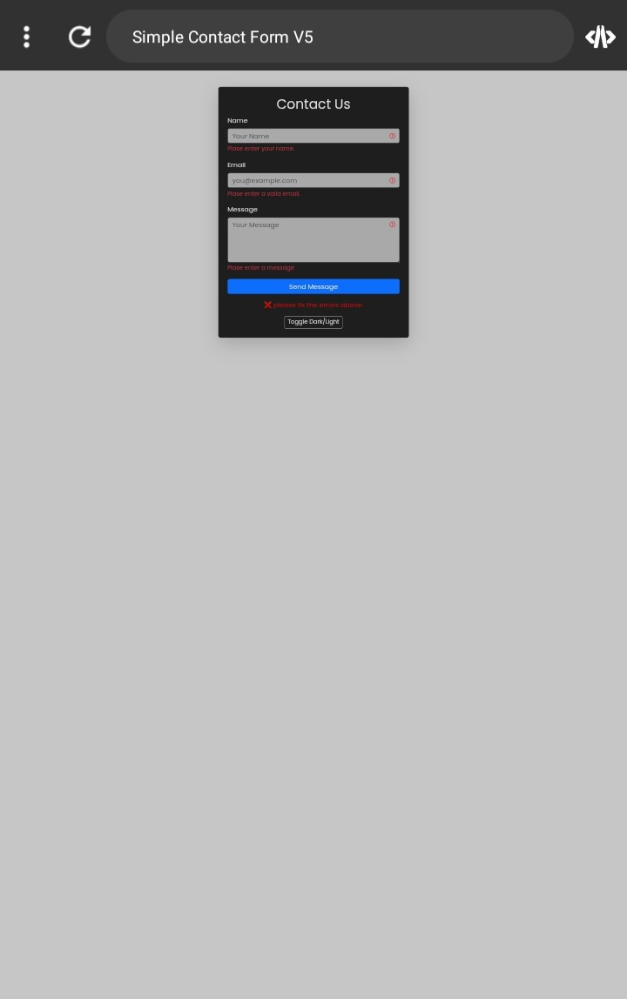

# Simple Contact Form V5  

A modern and responsive contact form built with **Bootstrap 5** and **JavaScript**.  

## 🌟 Features
- Real-time form validation (Name, Email, Message)
- Success & error message handling
- Dark/Light theme toggle
- Fully responsive design
- Clean and modern UI

📸 **Preview:**  



---

## ⚙️ Technologies Used
- HTML5  
- CSS3  
- Bootstrap 5  
- JavaScript (ES6)

---

## 🚀 How to Use
1. Clone the repository  
   ```bash
   git clone https://github.com/farhad-dev84/simple-contact-form-v5.git
   ```
2. Open `index.html` in your browser.  
3. You can integrate it with your backend to handle real submissions.

---

## 🧑‍💻 Author
**Farhad Akbary**  
Front-End Developer | JavaScript & Bootstrap Specialist  
📧 Email: your-email@example.com  

---

# 🇮🇷 نسخه فارسی

## فرم تماس نسخه ۵  

فرم تماس مدرن و واکنش‌گرا ساخته‌شده با **Bootstrap 5** و **JavaScript**.  

### ✨ ویژگی‌ها
- اعتبارسنجی لحظه‌ای نام، ایمیل و پیام  
- نمایش پیام موفقیت یا خطا  
- حالت تیره و روشن  
- طراحی کاملاً واکنش‌گرا  
- رابط کاربری تمیز و مدرن  

📸 **پیش‌نمایش:**  


---

### ⚙️ تکنولوژی‌های استفاده‌شده
- HTML5  
- CSS3  
- Bootstrap 5  
- JavaScript (ES6)

---

### 💬 نحوه استفاده
1. ریپازیتوری را کلون کنید:  
   ```bash
   git clone https://github.com/yourusername/simple-contact-form-v5.git
   ```
2. فایل `index.html` را در مرورگر باز کنید.  
3. در صورت نیاز، می‌توانید فرم را به بک‌اند خود متصل کنید.

---

👨‍💻 **طراح:** فرهاد اکبری  
توسعه‌دهنده Front-End | متخصص JavaScript و Bootstrap  
📧 ایمیل: your-email@example.com
